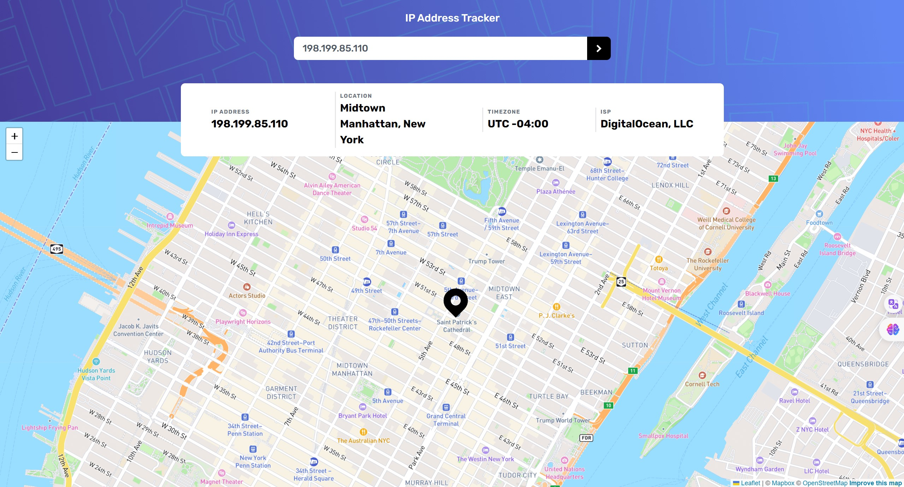

# Frontend Mentor - IP address tracker solution

This is a solution to the [IP address tracker challenge on Frontend Mentor](https://www.frontendmentor.io/challenges/ip-address-tracker-I8-0yYAH0). Frontend Mentor challenges help you improve your coding skills by building realistic projects.

## Table of contents

- [Overview](#overview)
  - [The challenge](#the-challenge)
  - [Screenshot](#screenshot)
  - [Links](#links)
- [My process](#my-process)
  - [Built with](#built-with)
  - [What I learned](#what-i-learned)
  - [Continued development](#continued-development)
- [Author](#author)
- [Acknowledgments](#acknowledgments)

## Overview

### The challenge

Users should be able to:

- View the optimal layout for each page depending on their device's screen size
- See hover states for all interactive elements on the page
- See their own IP address on the map on the initial page load
- Search for any IP addresses or domains and see the key information and location

### Screenshot

### Links

- Solution URL: [Add solution URL here](https://your-solution-url.com)
- Live Site URL: [IP Address Tracker Live site](https://fm-ipaddresstracker.netlify.app/)

## My process

### Built with

- Semantic HTML5 markup
- CSS custom properties
- Flexbox
- Mobile-first workflow
- [React](https://reactjs.org/) - JS library
- [React Leaflet](https://react-leaflet.js.org/) - React components for Leaflet maps
- [Tailwind CSS](https://tailwindcss.com/) - For styles
- [Mapbox](https://www.mapbox.com/) - For map tiles
- [IP Geolocation API](https://geo.ipify.org/) - IP Address tracker API 

### What I learned

I learned how to use some of the other react hoooks such as useMemo and useContext.
I learned how to work with maps, tiles, and how to customize them based on required needs.

## Author

- Website - [Mtendere Kulemeka Whayo](https://www.devmk.netlify.app)
- Frontend Mentor - [@mkulemeka](https://www.frontendmentor.io/profile/mkulemeka)
- Twitter - [@kahle01](https://www.twitter.com/kahle01)
